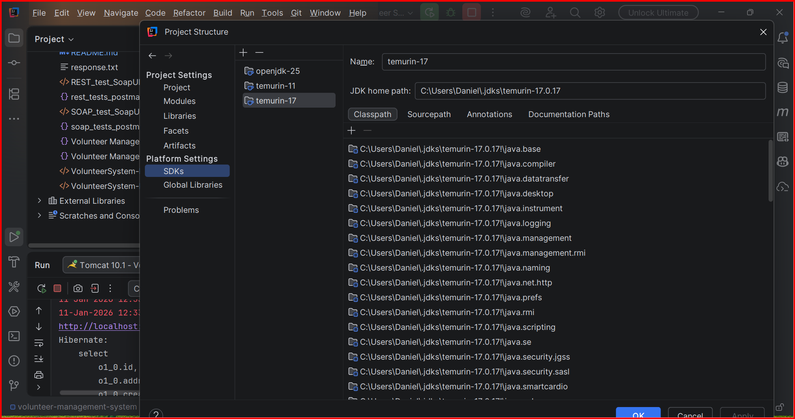
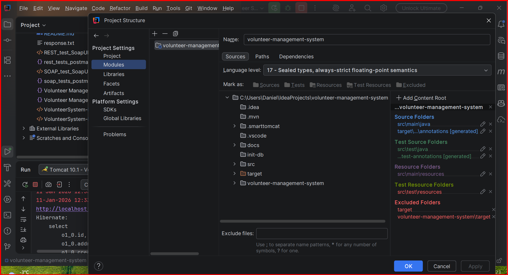
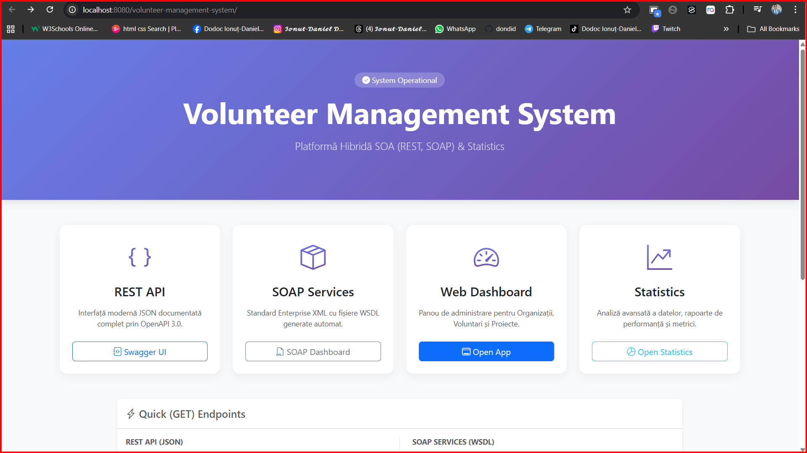
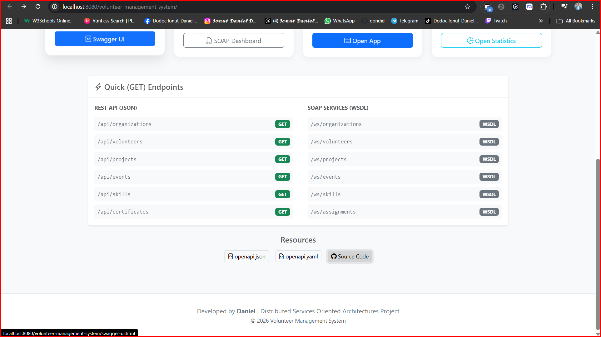
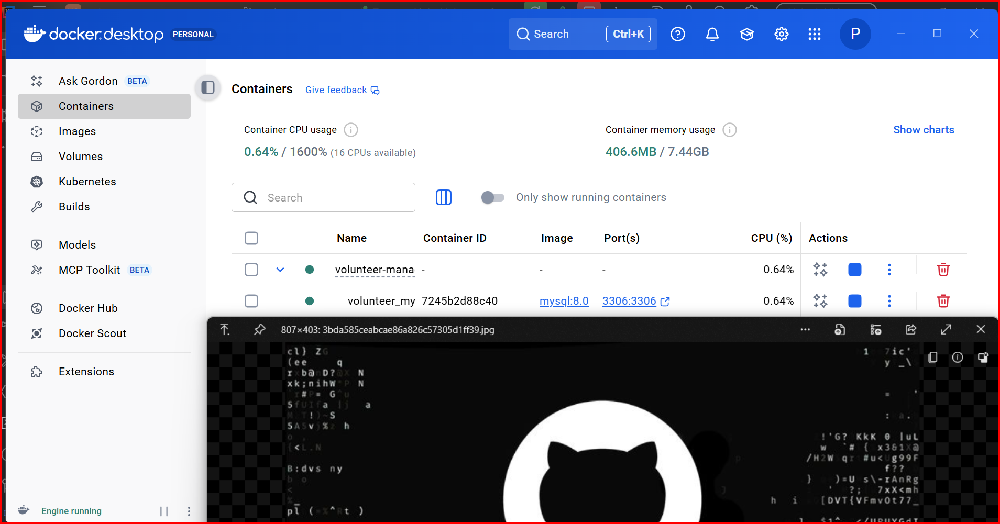
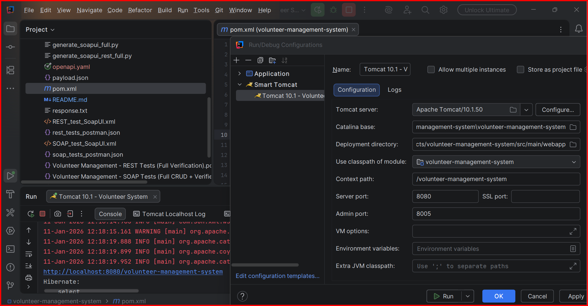
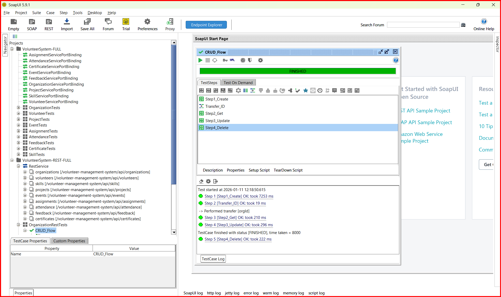

# Volunteer Management System - Hybrid API (REST & SOAP)

Sistem complet de management al voluntarilor implementat ca arhitectură hibridă (Dual-Protocol), conform cerințelor cursului **Distributed Services Oriented Architectures**.

## 📋 Descriere

Aplicația oferă o platformă centralizată pentru gestionarea ecosistemului de voluntariat:
- **Organizații & Voluntari**: Profiluri complete, validări stricte (CNP, Email).
- **Proiecte & Evenimente**: Management ciclu de viață (Planificat -> Activ -> Finalizat).
- **Asignări & Prezență**: Flux complet de înscriere, acceptare și pontaj ore.
- **Certificate & Feedback**: Generare automată și sistem de evaluare bidirecțional.
- **Statistici Avansate**: Rapoarte complexe în timp real.

## 🏗️ Arhitectură Hibridă (Dual-Stack)

Acest proiect demonstrează interoperabilitatea între două paradigme majore de web services, folosind **același strat de date și logică de business**:

### 1. REST API (JSON) - Modern & Mobile First
- **Endpoint**: `/api/*`
- **Specificație**: OpenAPI 3.0 (Swagger)
- **Documentație Interactivă**: [Swagger UI](http://localhost:8080/volunteer-management-system/swagger-ui.html)
- **Specificații Raw**: `openapi.json` / `openapi.yaml` (Disponibile în Portal)
- **Utilizare**: Aplicații web moderne, mobile apps, integrări ușoare.

### 2. SOAP Web Services (XML) - Enterprise & Legacy
- **Endpoint**: `/ws/*`
- **Specificație**: WSDL 1.1 (generat automat per serviciu)
- **Listă Servicii**: [Service Dashboard](http://localhost:8080/volunteer-management-system/ws/organizations)
- **Utilizare**: Integrări B2B, sisteme bancare/guvernamentale, tranzacții stricte.

---

## 🚀 Ghid de Instalare și Rulare

### Cerințe de Sistem
- **Java JDK 17+**
- **Maven 3.8+**
- **Docker & Docker Compose** (pentru baza de date)
- **Tomcat 10.1+** (sau GlassFish/Payara compatibil Jakarta EE 10)

### Pasul 1: Pornire Bază de Date
Proiectul include configurare automată pentru MySQL 8.0.
```bash
docker-compose up -d
```
*Aceasta va inițializa baza de date `volunteer_db` pe portul `3306`.*

### Pasul 2: Build Proiect
```bash
mvn clean package
```
*Va genera fișierul `target/volunteer-management-system.war`.*

### Pasul 3: Deploy
Deployați fișierul `.war` pe serverul de aplicații (Tomcat/GlassFish).
- **URL Aplicație**: `http://localhost:8080/volunteer-management-system`

---

## 🎥 Galerie & Demo
 
### Video Demonstrativ
Prezentare completă a funcționalităților Hybrid API (REST & SOAP).
<video src="foto_video/Hybrid Api (Rest & Soap).mp4" controls="controls" style="max-width: 100%;"></video>

> [!NOTE]
> Dacă video-ul nu rulează direct, îl puteți descărca de [aici](foto_video/Hybrid Api (Rest & Soap).mp4).

### 📐 Arhitectură & Structură
Diagrama completă a structurii modulelor și organizarea proiectului.

 

### 🖥️ Interfața Grafică (Web Dashboard)
Dashboard-ul administratorului pentru gestionarea voluntarilor și proiectelor.


Detaliere funcționalități interfață:



### 🛠️ Configurare & Bază de Date
Setup-ul Docker și configurările sistemului.



### ✅ Rezultate Testare
Validarea completă a API-urilor folosind Postman și SoapUI.

**Postman Collection Runner:**


**SoapUI Test Runner:**


---

## 🧪 Testare Automată (Full Coverage)

Proiectul vine cu suite complete de teste automate pentru ambele protocoale.

### A. SoapUI Automation (Recomandat)
Am generat proiecte SoapUI complete care acoperă fluxuri CRUD cap-coadă (Create -> Get -> Update -> Delete) cu transfer automat de date (ID-uri).

1.  **Instalați SoapUI 5.x** (Open Source).
2.  **Importați Proiectele** din folderul rădăcină:
    *   📂 **SOAP**: `VolunteerSystem-FULL-soapui-project.xml`
        *   Acoperă toate cele 9 servicii SOAP.
        *   Validări schema XSD și Fault-uri.
    *   📂 **REST**: `VolunteerSystem-REST-FULL-soapui-project.xml`
        *   Acoperă toate resursele REST.
        *   Validări coduri HTTP și structură JSON.

**Cum se rulează:**
1. Deschideți proiectul în SoapUI.
2. Dublu-click pe orice `TestCase` (ex: `OrganizationTests -> CRUD_Flow`).
3. Apăsați butonul ▶️ (Play).
4. Priviți cum testele trec pe verde! 🟢

### B. Postman Collections
Pentru testare rapidă și ușoară, am inclus colecții Postman pre-configurate.

**Fișiere Colecții:**
*   `rest_tests_postman.json`: Suită completă pentru REST API (Include teste pentru Statistici, CRUD, Validări).
*   `soap_tests_postman.json`: Suită pentru SOAP Web Services (XML requests).

**Cum se rulează:**
1.  Deschideți Postman.
2.  Folosiți butonul **Import** și selectați fișierul `.json` dorit din rădăcina proiectului.
3.  Deschideți colecția importată din bara laterală.
4.  Pentru a rula toate testele automat:
    *   Faceți click dreapta pe numele colecției -> **Run collection**.
    *   Asigurați-vă că ordinea request-urilor este corectă (Create -> Get -> Update -> Delete).
    *   Apăsați **Run Volunteer Management...**.
5.  Verificați tab-ul **Test Results** pentru fiecare request - toate ar trebui să fie "PASS".

---

## 📊 Module și Funcționalități Cheie

### 1. Statistici și Rapoarte (`/api/statistics`)
Modul avansat de analiză a datelor folosind query-uri complexe JPQL/SQL:
- **Overall Metrics**: Totaluri globale.
- **Top Performers**: Voluntari cu cele mai multe ore (Paginat & Sortat).
- **Project Analytics**: Rating mediu, grad de ocupare.
- **Skill Demand**: Cele mai căutate competențe.

### 2. Validări Stricte
Sistemul refuză date inconsistente pentru a menține integritatea:
- **Unicitate**: Email, CNP, Cod Înregistrare.
- **Logică de Business**: Un voluntar nu poate fi șters dacă are asignări active; Data de final nu poate fi înaintea celei de început.
- **Format**: Regex pentru Telefon (10 cifre) și CNP (13 cifre).

---

## 📂 Structură Proiect

```
/src/main/java
  /ro/ucv/inf/soa
    /api        -> Resurse JAX-RS (REST Controllers)
    /ws         -> Endpoint-uri JAX-WS (SOAP Services)
    /model      -> Entități JPA (Database Mapping)
    /repository -> Acces Date (DAO Pattern)
    /service    -> Logică Business
    /client     -> Client Java demonstrativ
```

## 📝 Format Răspuns (Standardizat)

Toate răspunsurile REST (Succes sau Eroare) au aceeași structură pentru o integrare ușoară:

```json
{
  "success": true,
  "message": "Operation successful",
  "data": { ... }, 
  "timestamp": 1704879000000
}
```

---

## 👤 Autor
Proiect realizat de **Daniel** pentru Masterat, conform cerințelor cursului Distributed Services Oriented Architectures.
